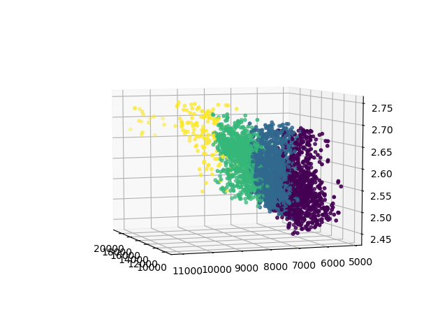

# Seismic Facies Clustering
> An Example of Using KMeans (Unsupervised ML) 
> for Seismic Facies Clustering

Seismic Facies Clustering is a traditional unsupervised machine learning problem. The idea is using a few attribute volumes to generate a facies volume. Like any other clustering problem, the attribute volumes show different aspects of rock properties, therefore an unsupervised method should be able to make different clusters using these attributes.

For this specific code, we use 4 volumes as input: 

1) VP or P-wave velocity volume (in SEGY format)

2) VS or S-wave velocity volume (in SEGY format)

3) RHOB or bulk density volume (in SEGY format)

4) A useful attribute (in SEGY format)

The method that is used for this approach is KMeans. KMeans is not a robust algorithm in clustering, but it is very fast compared to other techniques. The speed of clustering algorithm is very important for seismic-related machine learning projects (because of size of seismic data). 

The output of this code is a facies volume (in SEGY format). 

## Running the Code
Run the codes in Jupyter Notebook.
